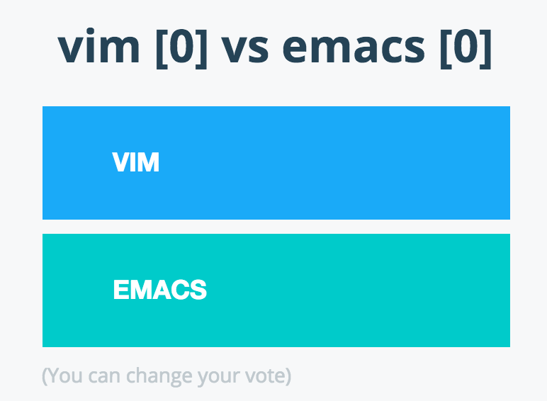
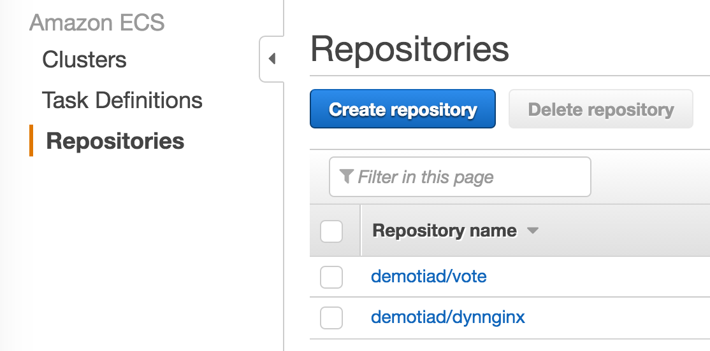
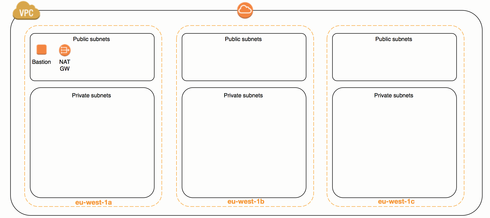
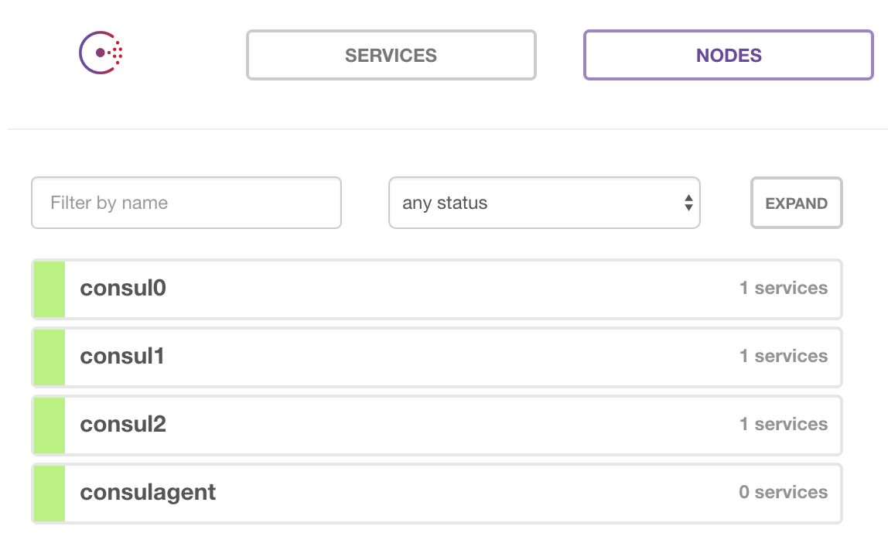

The python application used in the demo ("vote") is derived from the docker [example-voting-vote](https://github.com/docker/example-voting-app). Many thanks to them!

## How to use the code from this demo

### Build the vote application image and test it
```
docker build -t demotiad/vote:0.1 --build-arg version=0.1 app/vote
docker tag demotiad/vote:0.1 demotiad/vote:latest
```
You can have a look at the image metadata
```
docker inspect --format='{{json .ContainerConfig.Labels}}'  demotiad/vote:0.1 | jq .
docker run --rm demotiad/vote:0.1 cat /Dockerfile
```
Start the application
```
docker-compose -f app/simple-compose.yml up
```
This compose file simply starts the vote application and a redis container. You can now connect to the application in your browser ([http://localhost:8080](http://localhost:8080))



There is another compose file which mounts the app directory to allow live edit of the python code (devsimple-compose.yml).

Destroy the containers
```
docker-compose -f app/simple-compose.yml down
```

### Upload the image to ECR
Create necessary ECR repositories (dynnginx is a supporting image used later). You need to have valid AWS credentials in your environment.
```
aws ecr create-repository --repository-name demotiad/vote
aws ecr create-repository --repository-name demotiad/dynnginx
```
Build the dynnginx image
```
docker build -t demotiad/dynnginx app/dynnginx
```
Get your repositories ids
```
voterepo=$(aws ecr describe-repositories --repository-names demotiad/vote --query 'repositories[0].repositoryUri' --output text)
nginxrepo=$(aws ecr describe-repositories --repository-names demotiad/dynnginx --query 'repositories[0].repositoryUri' --output text)
```
Tag the images with remote repositories
```
docker tag demotiad/vote:0.1 ${voterepo}:0.1
docker tag demotiad/vote:latest ${voterepo}:latest
docker tag demotiad/dynnginx:latest ${nginxrepo}:latest
```
Log to ECR and push the images
```
$(aws ecr get-login)
docker push ${voterepo}:0.1
docker push ${voterepo}:latest
docker push ${nginxrepo}:latest
```
The images are now available in ECR



## Build the infrastructure in aws
### Configure your remote states
This repository uses [terragrunt](https://github.com/gruntwork-io/terragrunt) to configure terraform remote states (which wil be stored in S3). To use terragrunt, download it [here](https://github.com/gruntwork-io/terragrunt/releases) and update the .terragrunt files to use your own bucket (replace mybucket in the command):
```
find terraform -name .terragrunt -exec sed -i 's/bucket =.*/bucket = "mybucket"/' {} \;
```
Without terragrunt you will need to configure the remote states for each terraform stack. For instance for the vpc:
```
terraform remote config -backend=s3 -backend-config="bucket=mybucket" -backend-config="key=demotiad/vpc
```
In addition, to allow for cross-stack references we need to update the bucket used to store states in tfvar files (replace mybucket in the command):
```
find terraform -name 'terraform.tfvars' -exec sed 's/state_bucket =.*/state_bucket = "mybucket"/' {} \;
```
### Create a VPC for your environment
The configuration of the vpc can be found in ```vpc/terraform.tfvars```. Update the key_name so you can connect to the bastion instance. In addition, the bastion.tf createas a public DNS record for the bastion (using the zone configured with the parameter public_zone). If you don't have a public route53 zone, simply remove the resource aws_route53_record from bastion.tf (you will have to connect to the bastion using its ip)
```
cd terraform/vpc
terragrunt apply
```


### Build the consul cluster
```
cd ../consul
terragrunt apply
```


To connect to the conul UI we need to tunnel through the bastion (adapt with your public zone or use the bastion IP)
```
ssh admin@bastion.awsdemo.d2-si.eu -L 8500:consulagent:8500
```
The consul UI is now available at [http://localhost:8500](http://localhost:8500)



